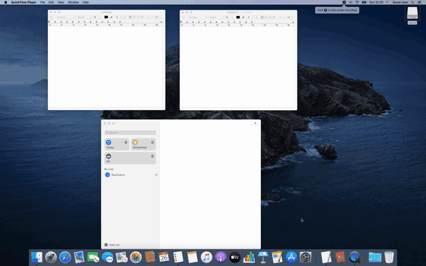
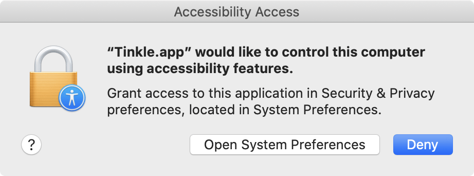

[](https://github.com/pqrs-org/Tinkle/actions)
[](https://github.com/pqrs-org/Tinkle/blob/master/LICENSE.md)

# Tinkle

Tinkle is a macOS app which appends a visual effect for the focused window changes.<br/>
It helps finding the focused window when you switched it by keyboard shortcuts.



---

## Supported systems

macOS Catalina (10.15) or later.

### Required privilege

Tinkle requires accessibility features in order to detect the focused window changes.



---

## Using a pre-built binary

Use `dist/Tinkle-xxx.dmg`

## Building from source code

Execute make command on the terminal.

```shell
make -C src
```

`src/build/Release/Tinkle.app` is a built file.
